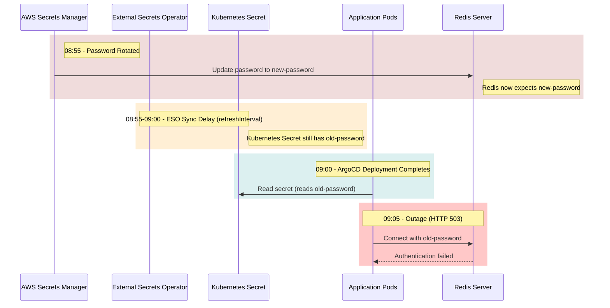

# Exercise 15 – Complete Production Outage RCA

## 📋 Incident Overview
At **09:05**, a complete production outage occurred resulting in **HTTP 503 Service Unavailable** errors for users. 
While **ArgoCD** reported the application as `Healthy`, the **Ingress** controller was healthy, and the application **Pods** were `Running`, the application logs reported `Cannot connect to Redis`, and Redis logs reported `Authentication failed` shortly after an automated secret rotation in Secrets Manager.

---

## 🕒 1. Incident Timeline

| Time | Event | Component | Details |
|---|---|---|---|
| **08:55** | Automated Secret Rotation | **AWS Secrets Manager** | The Redis authentication secret is rotated. The Secrets Manager rotation lambda updates the active password on the **Redis** server to `new-password`. |
| **08:55 - 09:00** | Secret Synchronization Gap | **External Secrets Operator** | The Kubernetes Secret (`redis-secret`) is **not** updated. The External Secrets Operator (ESO) operates on a polling interval (`refreshInterval`), which has not yet fired. The K8s secret remains stale containing `old-password`. |
| **09:00** | GitOps Sync & App Deployment | **ArgoCD** | A scheduled or manual GitOps sync completes. The application deployment is rolled out. New application pods are spawned. |
| **09:00** | Pod Startup Configuration | **Application Pods** | The new pods load the Redis password from the stale Kubernetes Secret (`redis-secret`) into static environment variables (`valueFrom.secretKeyRef`). |
| **09:00 - 09:05** | Auth Failures Begin | **Application & Redis** | Application pods attempt to connect to Redis using the loaded `old-password`. Redis rejects these attempts with `Authentication failed`. |
| **09:05** | Production Outage | **Ingress & Client Traffic** | The application fails to handle traffic. Readiness probes (if not validating Redis) or runtime errors cause HTTP 503 errors. Ingress is healthy but its backends are degraded. ArgoCD shows `Healthy` because manifests are in sync with Git. |

### Visual Sequence of the Desynchronization



---

## 🔍 2. Root Cause Analysis (RCA)

The outage was caused by a **race condition and synchronization mismatch** between external secret rotation, Kubernetes secret reconciliation, and application deployment rollout:

1. **Pull-Based Polling Latency in ESO**: The External Secrets Operator (ESO) pulls secret updates asynchronously at set intervals (defined by `refreshInterval`, which defaults to `1h`). Because rotation occurred at 08:55 and the deployment completed at 09:00, the Kubernetes Secret was still stale.
2. **Immutable Environment Variables**: The application reads secrets via static environment variables (`valueFrom.secretKeyRef`). In Kubernetes, environment variables are only set when a container is created. Even if the Kubernetes Secret updated later, the running pods would continue using the old password until restarted.
3. **ArgoCD Sync Visibility Gap**: ArgoCD only checks the sync status of Git manifests (such as the `ExternalSecret` declaration). It cannot see the actual secret values inside the generated Kubernetes `Secret` or verify if they match the external Secret Manager. Therefore, ArgoCD reported a false-positive `Healthy` status.
4. **Lack of DB Health-Check in Readiness Proes**: The application pods were marked as `Running` and passed basic readiness checks, allowing the rollout to complete. Because the readiness probe did not validate downstream database connectivity (Redis), traffic was routed to broken pods.

---

## 🛠️ 3. Immediate Fix

To restore the service immediately, execute the following steps:

### Step 1: Force Re-sync of the External Secret
Force the External Secrets Operator to immediately sync the rotated secret from Secrets Manager to the Kubernetes Secret:
```bash
kubectl annotate externalsecret <externalsecret-name> force-sync=$(date +%s) --overwrite -n <namespace>
```
*Verify that the secret was updated:*
```bash
kubectl get secret <secret-name> -n <namespace> -o yaml
```

### Step 2: Rollout Restart the Application
Once the Kubernetes Secret is verified as updated, restart the application pods to load the new credentials:
```bash
kubectl rollout restart deployment/<app-deployment-name> -n <namespace>
```

### Step 3: Validate Recovery
Inspect application and Redis logs to ensure authentication is succeeding:
```bash
kubectl logs -n <namespace> -l app=<app-name> --tail=50
```

---

## 🛡️ 4. Long-Term Prevention

To prevent similar outages in the future, implement the following architectural improvements:

### A. Automate Secret-Driven Rollouts (Reloader)
Deploy **Reloader** (a Kubernetes controller that watches ConfigMaps and Secrets) to automatically trigger rolling upgrades on Deployments when their referenced secrets are updated.
```yaml
# Add this annotation to the Deployment template metadata:
metadata:
  annotations:
    reloader.stakater.com/auto: "true"
```

### B. Mount Secrets as Volumes (Dynamic Reloading)
Instead of static environment variables, mount secrets as file volumes. Kubernetes automatically updates files in mounted volumes when the secret changes.
```yaml
spec:
  containers:
  - name: application
    volumeMounts:
    - name: redis-creds
      mountPath: /etc/secrets/redis
      readOnly: true
  volumes:
  - name: redis-creds
    secret:
      secretName: redis-secret
```
Configure the application code to watch the file `/etc/secrets/redis/password` for changes and dynamically re-establish the connection pool when the password changes.

### C. Optimize `refreshInterval`
Ensure critical application secrets have a short `refreshInterval` (e.g., `1m` or `2m`) inside the `ExternalSecret` manifest:
```yaml
spec:
  refreshInterval: "1m"
```

### D. Dual-Password Support during Rotation
Ensure the rotation policy in Secrets Manager supports a grace period where both the old and new passwords are valid simultaneously (dual-password or temporary ACLs in Redis). This gives the Kubernetes Secret and application pods time to sync without downtime.

---

## 📊 5. Monitoring & Alerting Improvements

To detect secret desynchronization and connectivity issues before they cause client-facing outages:

### A. Implement Custom ArgoCD Health Checks
Add a custom health check configuration in ArgoCD for `ExternalSecret` resources to ensure they reflect a `Degraded` state if not synchronized:
```yaml
resource.customations.health.external-secrets.io_ExternalSecret: |
  hs = {}
  if obj.status ~= nil then
    if obj.status.conditions ~= nil then
      for i, cond in ipairs(obj.status.conditions) do
        if cond.type == "Ready" and cond.status == "True" then
          hs.status = "Healthy"
          hs.message = "Secret is in sync"
          return hs
        end
      end
    end
  end
  hs.status = "Degraded"
  hs.message = "Secret is out of sync"
  return hs
```

### B. Database Health Validation in Readiness Probes
Configure the application's readiness probe to perform a lightweight ping to Redis. If authentication fails, the pod becomes `Unready`, preventing traffic routing and stopping broken deployments from rolling out:
```yaml
readinessProbe:
  httpGet:
    path: /healthz  # This endpoint should query Redis connectivity
    port: 8080
  initialDelaySeconds: 5
  periodSeconds: 10
```

### C. Prometheus Alerts for ESO Sync Status
Alert on failed secret synchronizations:
```yaml
groups:
- name: external-secrets-alerts
  rules:
  - alert: ExternalSecretSyncFailed
    expr: externalsecrets_status_condition{status="False", type="Ready"} > 0
    for: 5m
    labels:
      severity: warning
    annotations:
      summary: "ExternalSecret sync failed for {{ $labels.name }}"
```

### D. Redis Connection Failure Alerts
Set up log-based alerting for application connection errors (`Cannot connect to Redis`) and Redis authentication failures (`Authentication failed`) using alloy/Loki or CloudWatch.
