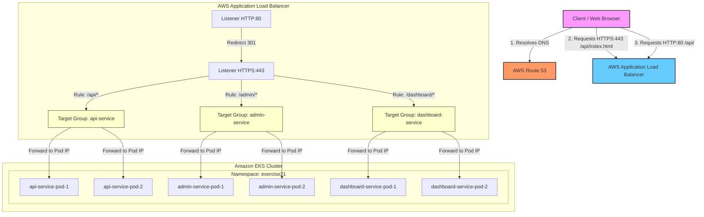

# Exercise 21: Production ALB Ingress Architecture

Below is the request flow from the end user to the specific Kubernetes microservice in the EKS cluster.

## Request Flow

## Description of Key Components

1. **Route 53**: Resolves the custom domain name (e.g. `apps.example.com`) to the AWS ALB CNAME.
2. **Application Load Balancer**: Created automatically by the AWS Load Balancer Controller based on the Ingress resource annotations.
3. **HTTP (80) Listener**: Automatically configured with a redirect rule to route all plain HTTP requests to HTTPS (443).
4. **HTTPS (443) Listener**: Offloads SSL/TLS using the AWS Certificate Manager (ACM) SSL Certificate.
5. **Path Rules**: Evaluated sequentially:
   - `/api/*` -> API Target Group
   - `/admin/*` -> Admin Target Group
   - `/dashboard/*` -> Dashboard Target Group
6. **EKS Target Groups**: Configure with `target-type: ip` which routes traffic directly to the Pod IPs, bypassing the NodePort kube-proxy layer for reduced latency.
