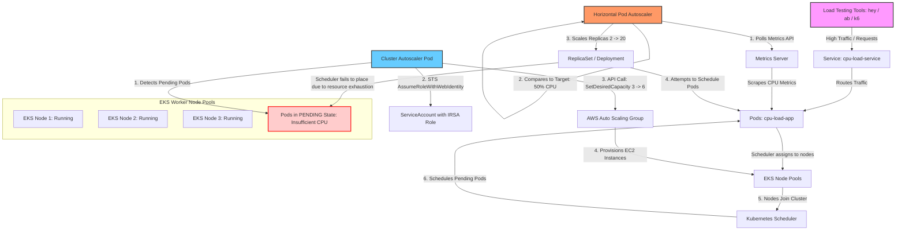

# Exercise 22: Horizontal and Cluster Autoscaling Architecture

This diagram illustrates the dual-level autoscaling system implemented in EKS:
1. **Horizontal Pod Autoscaler (HPA)**: Scales the application pods horizontally based on CPU load.
2. **Cluster Autoscaler (CA)**: Scales the EKS cluster worker nodes based on pending (unschedulable) pods.

## Autoscaling Workflow

## Scaling Logic Breakdown

### 1. Pod Scaling (HPA)
* The HPA polls the Metrics API (`v1beta1.metrics.k8s.io`) every 15 seconds.
* HPA calculation formula:
  $$\text{DesiredReplicas} = \lceil \text{CurrentReplicas} \times \frac{\text{CurrentMetricValue}}{\text{TargetMetricValue}} \rceil$$
* If the average CPU load across pods is 80% and the target is 50%, HPA scales the replica count up.

### 2. Node Scaling (Cluster Autoscaler)
* When HPA scales replicas up to 20, the physical limits of the existing nodes (3 nodes) are reached.
* The Kubernetes scheduler fails to assign the new pods to any node due to CPU exhaustion, putting them in `Pending` state.
* The Cluster Autoscaler daemon detects pods stuck in `Pending` due to lack of resources.
* It communicates with the AWS Auto Scaling Group (ASG) API via IRSA permissions to adjust the desired capacity (e.g., from 3 to 6).
* Once the new EC2 nodes join the EKS cluster, the scheduler runs the pending pods on them.
