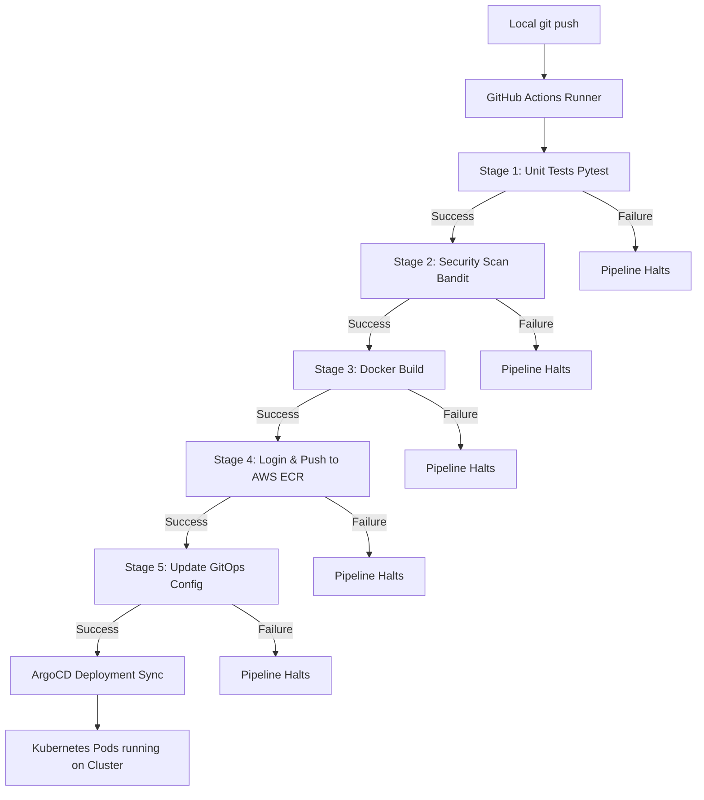

# Exercise-23: CI/CD Pipeline Failure Injection & Troubleshooting Lab

This repository contains a complete hands-on troubleshooting laboratory designed to teach engineers how to identify, debug, and recover from failures in modern CI/CD GitOps pipelines.

Rather than just deploying a Flask application, this lab guides you through **intentionally breaking** the pipeline, analyzing failure logs, tracing root causes, and applying fixes.

---

## 📐 Architecture & Deployment Flow



---

## 📂 Project Structure

```text
exercise-23/
├── app/
│   ├── app.py                # Main Flask Application
│   └── requirements.txt      # Python dependencies
├── tests/
│   └── test_app.py           # Unit tests (Pytest)
├── .github/
│   └── workflows/
│       └── cicd.yml          # GitHub Actions Pipeline
├── docker/
│   └── Dockerfile            # Container specification
├── k8s/
│   ├── namespace.yaml        # Deployment Namespace
│   ├── deployment.yaml       # Deployment Spec
│   └── service.yaml          # ClusterIP service
├── gitops/
│   └── application.yaml      # ArgoCD Application resource
├── failure-scenarios/        # Detailed manuals for each lab failure
│   ├── scenario-1-unit-test-failure.md
│   ├── scenario-2-security-failure.md
│   ├── scenario-3-docker-build-failure.md
│   ├── scenario-4-ecr-failure.md
│   └── scenario-5-gitops-failure.md
└── README.md                 # This Lab Guide
```

---

## 📋 Pipeline Stages Explained

1. **Unit Tests (`pytest`):** Runs tests to verify code functionality. Validates `/` and `/healthz` endpoints.
2. **Security Scan (`bandit`):** Audits code for common security vulnerabilities (e.g. hardcoded secrets, unsafe functions).
3. **Docker Build:** Packages the app using a multi-stage Dockerfile into a slim, secure container running as `appuser`.
4. **Push Image (Amazon ECR):** Authenticates via AWS CLI credentials and pushes container image tags.
5. **GitOps Tag Update:** Auto-updates `k8s/deployment.yaml` with the latest commit SHA image tag and commits it back.
6. **ArgoCD Auto Sync:** ArgoCD monitors the updated deployment tag and applies the manifest changes to the Kubernetes cluster.

---

## 🔬 Troubleshooting Lab Scenarios

This lab is split into five failure modules. To work through them, refer to the documentation inside `failure-scenarios/`:

### [1. Unit Test Failure](file:///home/satoru/Projects/Devops-Exercise/Exercise-23/failure-scenarios/scenario-1-unit-test-failure.md)
* **Goal:** Break the application response to cause Pytest assertions to fail.
* **Failure Injection:** Change `/healthz` return type to text in `app/app.py`.
* **Fix:** Restore JSON dict response structure.

### [2. Security Scan Failure](file:///home/satoru/Projects/Devops-Exercise/Exercise-23/failure-scenarios/scenario-2-security-failure.md)
* **Goal:** Introduce vulnerability to trigger Bandit alerts.
* **Failure Injection:** Hardcode credentials string in `app/app.py`.
* **Fix:** Load secrets dynamically from environment variables.

### [3. Docker Build Failure](file:///home/satoru/Projects/Devops-Exercise/Exercise-23/failure-scenarios/scenario-3-docker-build-failure.md)
* **Goal:** Intentionally break container build context instructions.
* **Failure Injection:** Add typo in COPY path directive in `docker/Dockerfile`.
* **Fix:** Correct spelling for requirements target.

### [4. AWS ECR Push Failure](file:///home/satoru/Projects/Devops-Exercise/Exercise-23/failure-scenarios/scenario-4-ecr-failure.md)
* **Goal:** Trigger authentication/permission errors at AWS integration stage.
* **Failure Injection:** Set invalid `AWS_SECRET_ACCESS_KEY` in GitHub secrets.
* **Fix:** Update variables using valid IAM keys matching access permissions.

### [5. GitOps Repository Update Failure](file:///home/satoru/Projects/Devops-Exercise/Exercise-23/failure-scenarios/scenario-5-gitops-failure.md)
* **Goal:** Trigger git remote rejection when committing tag changes.
* **Failure Injection:** Delete or alter `GITOPS_TOKEN` secret in GitHub.
* **Fix:** Recreate a classic Personal Access Token with correct `repo` permissions.

---

## 🛠️ Local Diagnostic Commands

Run these utilities locally within the project folder to troubleshoot failures:

```bash
# 1. Run unit test suite
pip install -r app/requirements.txt
pytest -v

# 2. Run security checks
bandit -r app/

# 3. Perform test docker build
docker build -f docker/Dockerfile -t test-app:local .

# 4. Verify AWS IAM Identity
aws sts get-caller-identity
```
