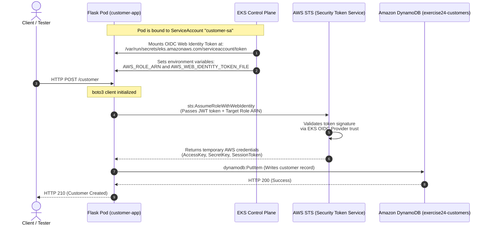

# Exercise 24: DynamoDB Application Architecture (IRSA)

This diagram shows the end-to-end authentication and authorization flow of the customer application accessing DynamoDB using IAM Roles for Service Accounts (IRSA).

## System Flow

## Description of Steps

1. **Token Ingestion**: The EKS pod admission controller mutates pods that specify `serviceAccountName: customer-sa`. It projects the OIDC Web Identity token file into the pod and configures the environment variables `AWS_ROLE_ARN` and `AWS_WEB_IDENTITY_TOKEN_FILE`.
2. **REST Request**: The client fires a CRUD request (POST/GET/PUT) to the Flask microservice.
3. **AWS STS AssumeRole**: The AWS SDK (`boto3`) notices the `AWS_ROLE_ARN` and `AWS_WEB_IDENTITY_TOKEN_FILE` environment variables. It automatically handles calling AWS STS using `AssumeRoleWithWebIdentity` to exchange the projected token for short-lived credentials.
4. **Trust Validation**: AWS STS validates the projected token's signature against the EKS cluster's OIDC Identity Provider configured in IAM.
5. **Session Credentials**: STS returns temporary, rotated credentials valid for 1 hour.
6. **DynamoDB Access**: Boto3 uses the temporary credentials to sign requests and securely query or modify items in the DynamoDB table.
