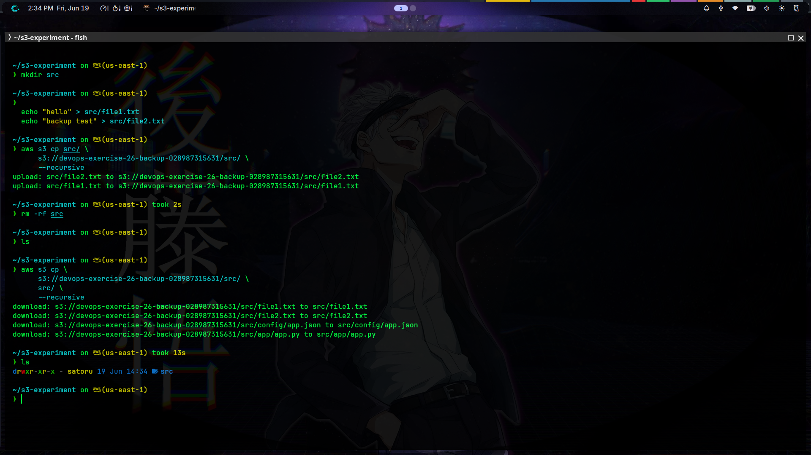

# Exercise 26: AWS S3 Backup and Restore (Direct Commands)

## Objective

Learn how to:
* Create an S3 bucket
* Perform a backup of application and configuration files using direct AWS CLI commands
* Package configurations for archival storage
* Verify uploaded objects in S3
* Demonstrate a full restore process simulating disaster recovery using direct CLI commands
* Understand cloud object storage

---

## Concepts

### What is S3?
Amazon S3 (Simple Storage Service) is an object storage service provided by AWS.
Unlike a normal block/file storage system, S3 stores files as **Objects** inside **Buckets**.
Each object contains:
* **Key** (the unique path/filename)
* **Data** (the actual content of the file)
* **Metadata** (headers, tags, system metadata)
* **Version ID** (for version control)

### Real World Use Cases
* **Database Backups**: Dumping databases (e.g. `mysqldump`) and uploading the resulting SQL files to S3.
* **Jenkins/CI-CD Backups**: Bundling CI configuration/home directories and archiving them to S3.
* **Application Log Archiving**: Moving old logs from active application servers to cost-effective S3 storage.
* **Kubernetes/Infrastructure Backups**: Archiving cluster configuration manifests or etcd snapshots.

---

## Architecture

```text
Local Machine (Application Host)
      |
      | Direct AWS CLI commands (s3 sync + s3 cp)
      |
      V
+------------------------------------------+
|            Amazon S3 Bucket              |
|   s3://devops-exercise-26-backup-xxxx    |
+------------------------------------------+
  |                                     |
  | (Raw Sync)                          | (Archival)
  V                                     V
  /src/app/app.py                       /archives/backup.tar.gz
  /src/config/app.json
```

---

## Project Structure

```text
Exercise-26/
├── README.md          # Comprehensive documentation (this file)
└── src/
    ├── app/
    │   └── app.py     # Dummy application logic (Python)
    └── config/
        └── app.json   # Configuration file (JSON)
```

---

## Prerequisites

* **AWS CLI** v2 installed and configured.
* **IAM User** with appropriate access permissions (e.g. `AmazonS3FullAccess` or restricted write/read to the specific bucket).
* **Python 3** installed locally (to run the dummy application).

---

## Step-by-Step Workflow (Direct Commands)

### 1. Configuration & Authentication Verification
First, verify that your AWS CLI is authenticated and has the correct permissions:
```bash
aws sts get-caller-identity
```

### 2. Create the S3 Bucket
Create a globally unique S3 bucket (using the configured default region `us-east-1`):
```bash
aws s3 mb s3://devops-exercise-26-backup-028987315631
```

### 3. Backup raw application files recursively to S3
Synchronize the application directories directly to S3. The `--delete` flag removes any files on the destination S3 path that have been deleted locally:
```bash
aws s3 sync Exercise-26/src/ s3://devops-exercise-26-backup-028987315631/src/ --delete
```

### 4. Create an archival package and upload to S3
Compress the raw files into an archive, upload it, and clean up the local archive file:
```bash
tar -czf Exercise-26/backup.tar.gz -C Exercise-26 src
aws s3 cp Exercise-26/backup.tar.gz s3://devops-exercise-26-backup-028987315631/archives/backup.tar.gz
rm -f Exercise-26/backup.tar.gz
```

### 5. Verify the files exist on S3
Verify that S3 now holds both the raw files and the backup archive:
```bash
aws s3 ls s3://devops-exercise-26-backup-028987315631 --recursive
```

### 6. Simulate Data Loss
Delete the local application directories to simulate a host failure or accidental data deletion:
```bash
rm -rf Exercise-26/src
```

### 7. Restore the raw files from S3
Restore the application files directly from the S3 bucket:
```bash
aws s3 cp s3://devops-exercise-26-backup-028987315631/src/ Exercise-26/src/ --recursive
```

### 8. Download and verify the archive package (Alternative Recovery Path)
To verify the integrity of the archival tarball, download and extract it to a temporary recovery directory:
```bash
rm -rf Exercise-26/restore_archive && mkdir -p Exercise-26/restore_archive
aws s3 cp s3://devops-exercise-26-backup-028987315631/archives/backup.tar.gz Exercise-26/restore_archive/backup.tar.gz
tar -xzf Exercise-26/restore_archive/backup.tar.gz -C Exercise-26/restore_archive
```

### 9. Execute and verify the restored application
Run the restored application to confirm the config and application scripts are intact and operational:
```bash
python3 Exercise-26/src/app/app.py
```

---

## Verification Logs

### 1. Verify Caller Identity
```bash
$ aws sts get-caller-identity
{
    "UserId": "028987315631",
    "Account": "028987315631",
    "Arn": "arn:aws:iam::028987315631:root"
}
```

### 2. Verify S3 Sync and Archive Upload
```bash
$ aws s3 sync Exercise-26/src/ s3://devops-exercise-26-backup-028987315631/src/ --delete
Completed 167 Bytes/716 Bytes (137 Bytes/s) with 2 file(s) remaining
Completed 716 Bytes/716 Bytes (588 Bytes/s) with 2 file(s) remaining
upload: Exercise-26/src/app/app.py to s3://devops-exercise-26-backup-028987315631/src/app/app.py
upload: Exercise-26/src/config/app.json to s3://devops-exercise-26-backup-028987315631/src/config/app.json

$ tar -czf Exercise-26/backup.tar.gz -C Exercise-26 src
$ aws s3 cp Exercise-26/backup.tar.gz s3://devops-exercise-26-backup-028987315631/archives/backup.tar.gz
Completed 620 Bytes/620 Bytes (112 Bytes/s) with 1 file(s) remaining
upload: Exercise-26/backup.tar.gz to s3://devops-exercise-26-backup-028987315631/archives/backup.tar.gz
```

### 3. Verify S3 Contents
```bash
$ aws s3 ls s3://devops-exercise-26-backup-028987315631 --recursive
2026-06-19 09:56:28        620 archives/backup.tar.gz
2026-06-19 09:18:46        549 src/app/app.py
2026-06-19 09:17:34        167 src/config/app.json
```

### 4. Verify Local Restoration
```bash
$ rm -rf Exercise-26/src
$ aws s3 cp s3://devops-exercise-26-backup-028987315631/src/ Exercise-26/src/ --recursive
Completed 167 Bytes/716 Bytes (131 Bytes/s) with 2 file(s) remaining
Completed 716 Bytes/716 Bytes (458 Bytes/s) with 1 file(s) remaining
download: s3://devops-exercise-26-backup-028987315631/src/config/app.json to Exercise-26/src/config/app.json
download: s3://devops-exercise-26-backup-028987315631/src/app/app.py to Exercise-26/src/app/app.py
```

**Screenshot — S3 Backup and Restoration Verification**




### 5. Run Restored Application
```bash
$ python3 Exercise-26/src/app/app.py
Starting Dummy Application...
Application started in production mode.
Database host: db.production.internal:5432
```

---

## Troubleshooting

### 1. Access Denied
* **Error**: `An error occurred (AccessDenied) when calling the PutObject operation`
* **Cause**: The IAM User/Role does not have permission to write to this bucket.
* **Fix**: Attach the `AmazonS3FullAccess` policy, or write a custom IAM policy allowing `s3:ListBucket`, `s3:GetObject`, and `s3:PutObject` on `arn:aws:s3:::devops-exercise-26-backup-028987315631*`.

### 2. Invalid Credentials
* **Error**: `An error occurred (InvalidAccessKeyId) when calling the GetCallerIdentity operation`
* **Cause**: Your AWS environment variables or credentials file references obsolete keys.
* **Fix**: Re-run `aws configure` to verify and configure valid AWS access key credentials.

### 3. Bucket Name Already Exists
* **Error**: `An error occurred (BucketAlreadyExists) when calling the CreateBucket operation`
* **Cause**: S3 bucket names are globally unique across all AWS accounts.
* **Fix**: Change the bucket name suffix in the configuration parameters of your command strings.

---

## Interview Questions

### What is S3?
Amazon Simple Storage Service (S3) is a fully managed cloud object storage service that provides industry-leading scalability, data availability, security, and performance.

### Difference Between EBS and S3?

| Feature | EBS | S3 |
| :--- | :--- | :--- |
| **Storage Type** | Block Storage | Object Storage |
| **Access Pattern** | Must be attached to a single EC2 instance (POSIX file system) | Accessed via REST API / HTTP endpoints from anywhere |
| **Latency** | Very low (ideal for databases and OS drives) | Higher latency, but scalable throughput |
| **Cost** | More expensive per GB | Highly cost-effective (S3 Standard, Infrequent Access, Glacier) |

### Why Use S3 for Backups?
S3 is extremely cheap, scales infinitely without manual provisioning, integrates easily with life-cycle policies to transition old backups to glacier (archival), and offers 99.999999999% (11 9s) durability.

### What is a Bucket?
A bucket is a logical partition/container in S3 used to store objects. Bucket names must be globally unique across all AWS regions.

### What is an Object?
An object is the fundamental entity stored in S3. It consists of user data, key (path), metadata, and a version ID.

---

## Screenshots to Capture

1. **AWS Configuration and Credentials Check**
   * Output of `aws configure` (keys redacted) and `aws sts get-caller-identity`.
2. **S3 Bucket Creation**
   * Output showing execution of `aws s3 mb s3://devops-exercise-26-backup-028987315631`.
3. **Backup Sync Command**
   * Command line log of `aws s3 sync` and archive creation.
4. **S3 Objects Listing**
   * Output of `aws s3 ls s3://devops-exercise-26-backup-028987315631 --recursive`.
5. **Restore Commands Execution**
   * Output showing simulated file deletion, `aws s3 cp` restore command, and successful execution of the application from restored files.
   * 

---

## Experiment Outcome

After completing this experiment, we have verified:
* Command-line identity checks, bucket creation, object lifecycle, and S3 sync operations.
* Synchronizing configurations and raw scripts directly to an S3 bucket.
* Packaging files into compressed tar archives for point-in-time recovery.
* Complete restore of files from S3 to restore functionality of the local runtime environment.
