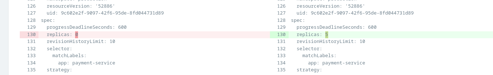
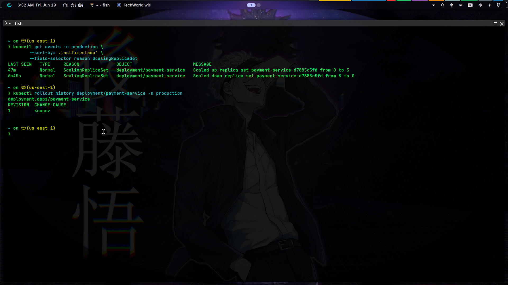
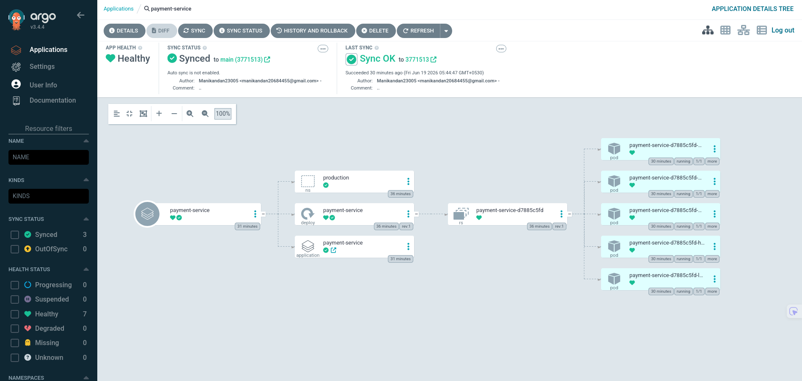
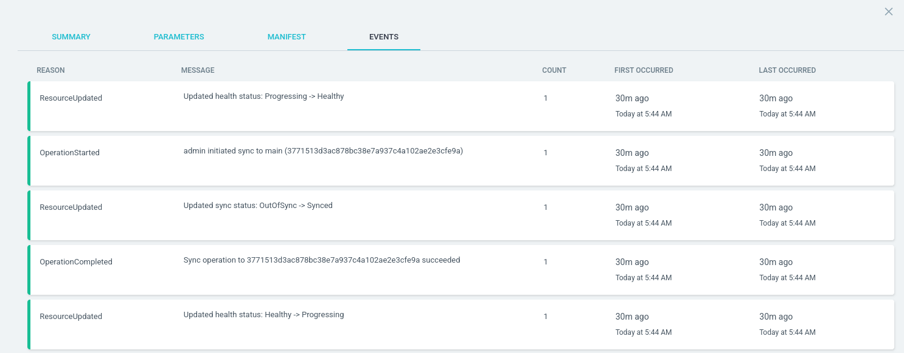
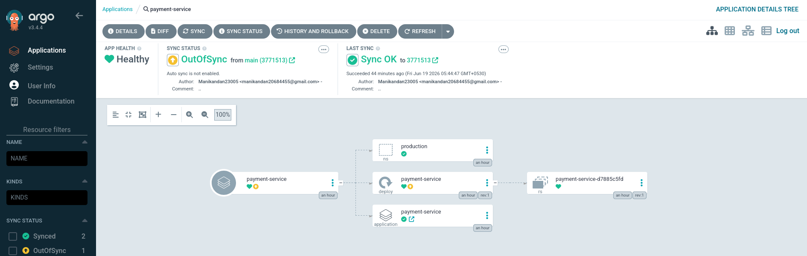

# Exercise 3 – ArgoCD OutOfSync Production Incident

## Objective

Investigate why an ArgoCD Application is reporting `OutOfSync` in production, diagnose
the replica count drift between the Git-desired state and the live Kubernetes cluster,
and restore a healthy `Synced` status without downtime.

---

## Scenario

### Incident

The on-call engineer receives a PagerDuty alert at **03:14 UTC**:

```text
[CRITICAL] ArgoCD Application 'payment-service' is OutOfSync
Namespace    : production
Sync Status  : OutOfSync
Health Status: Degraded
Cluster      : prod-eks-cluster (ap-south-1)
```

The ArgoCD UI shows the application is **OutOfSync** — the live deployment replica count
has drifted from what is stored in Git.

### Observed Symptoms

| Signal | Value |
|---|---|
| ArgoCD Sync Status | `OutOfSync` |
| ArgoCD Health Status | `Degraded` |
| Git desired replicas | `5` |
| Live cluster replicas | `0` |
| Running pods | `0 / 5` |
| Last successful sync | `2026-06-18 22:00 UTC` |

### Timeline

```text
2026-06-18 22:00 UTC  ArgoCD synced commit def5678  →  replicas: 5  →  Healthy ✓
2026-06-19 02:45 UTC  Traffic spike, pods OOMKilled
2026-06-19 03:05 UTC  On-call engineer runs: kubectl scale deployment payment-service
                       --replicas=0  (intended to restart pods but forgot to scale back)
2026-06-19 03:14 UTC  ArgoCD detects drift  →  OutOfSync + Degraded alert fires
```

---

## Repository Structure

```text
Exercise-3/
├── README.md
├── gitops/
│   ├── apps/
│   │   └── payment-service/
│   │       └── argocd-app.yaml
│   └── manifests/
│       └── payment-service/
│           ├── namespace.yaml
│           ├── deployment.yaml        ← DESIRED state in Git  (replicas: 5)
│           ├── service.yaml
│           ├── configmap.yaml
│           └── hpa.yaml
├── broken-state/
│   └── deployment-live.yaml          ← LIVE drifted state on cluster (replicas: 0)
└── hands-on/
    ├── namespace.yaml
    ├── deployment.yaml               ← Used for live demo
    └── argocd-application.yaml
```

---

## Architecture

```text
Developer
  ↓  git push
GitHub Repository  (desired state  →  replicas: 5)
  ↓  webhook / poll
ArgoCD
  ↓  compares
Live Kubernetes Cluster  (actual state  →  replicas: 0)
```

Expected GitOps Flow:

```text
Git (replicas: 5)
  ↓
ArgoCD detects no diff
  ↓
Status: Synced + Healthy  ✓
```

Actual Broken Flow:

```text
Git (replicas: 5)
  ↓
On-call engineer manually runs:
  kubectl scale deployment payment-service --replicas=0
  ↓
Live cluster  →  replicas: 0
  ↓
Git ≠ Cluster  →  ArgoCD reports OutOfSync + Degraded
```

---

## Investigation

### Step 1: Check ArgoCD Application Status

```bash
argocd app list
```

```bash
argocd app get payment-service
```

Expected output:

```text
Name:               payment-service
Sync Status:        OutOfSync
Health Status:      Degraded
```

---

### Step 2: View the Exact Diff

```bash
argocd app diff payment-service
```

Expected output:

```diff
===== apps/Deployment production/payment-service ======
spec:
-  replicas: 5    # Git (desired state)
+  replicas: 0    # Live cluster (drifted — manually scaled by on-call)
```

**Screenshot — ArgoCD Diff View (replicas: 0 vs replicas: 5)**



This single line tells the whole story: Git wants **5** replicas, the cluster has **0**.

---

### Step 3: Inspect the Live Deployment

```bash
kubectl get deployment payment-service -n production
```

Expected output:

```text
NAME              READY   UP-TO-DATE   AVAILABLE   AGE
payment-service   0/0     0            0           18h
```

```bash
kubectl get pods -n production -l app=payment-service
```

Expected output:

```text
No resources found in production namespace.
```

---

### Step 4: Find Who Scaled the Deployment

```bash
kubectl get events -n production \
  --sort-by='.lastTimestamp' \
  --field-selector reason=ScalingReplicaSet
```

```bash
kubectl rollout history deployment/payment-service -n production
```

**Screenshot — kubectl events and rollout history showing scale from 5→0 and 0→5**



---

### Step 5: Check ArgoCD Sync History

```bash
argocd app history payment-service
```

---

## Root Cause Analysis (RCA)

### Evidence

| Finding | Detail |
|---|---|
| Git desired replicas | `5` |
| Live cluster replicas | `0` |
| Cause of drift | On-call engineer ran `kubectl scale deployment payment-service --replicas=0` at 03:05 UTC |
| Reason for manual scale | Intended to restart pods during OOMKilled incident |
| Why replicas stayed at 0 | Engineer forgot to scale back up after pods restarted |
| ArgoCD selfHeal | Disabled — did not auto-revert the manual change |

### Root Cause

The on-call engineer manually scaled the deployment to `0` using `kubectl` to stop
OOMKilled pods. The engineer forgot to scale back to `5`. Because ArgoCD `selfHeal` was
not enabled, it detected the drift but did not auto-correct it. The application was left
with zero pods, causing `Degraded` health.

---

## Fix

### Option A: Git-First Sync (Recommended)

Since Git already has the correct value (`replicas: 5`), trigger ArgoCD to re-sync:

```bash
argocd app sync payment-service
```

**Screenshot — ArgoCD Application: Synced + Healthy (5 pods running)**



**Screenshot — ArgoCD Sync Events Log**



---

### Option B: Emergency kubectl Scale (Break-Glass)

```bash
kubectl scale deployment payment-service \
  --replicas=5 \
  -n production

argocd app sync payment-service
```

---

### Verify Recovery

```bash
argocd app get payment-service
```

Expected:

```text
Sync Status:   Synced
Health Status: Healthy
```

```bash
kubectl get deployment payment-service -n production
```

Expected:

```text
NAME              READY   UP-TO-DATE   AVAILABLE   AGE
payment-service   5/5     5            5           18h
```

**Screenshot — ArgoCD showing OutOfSync state (after kubectl scale --replicas=0)**



---

## Key Concepts Learned

### What Is ArgoCD OutOfSync?

ArgoCD continuously compares the **desired state** (Git) with the **live state** (Kubernetes cluster).
When they differ, the application is marked `OutOfSync`.

```text
Git (source of truth)  ≠  Live Cluster  →  OutOfSync
Git (source of truth)  =  Live Cluster  →  Synced
```

---

### Why Is Manual `kubectl` Edit Dangerous in GitOps?

| Problem | Explanation |
|---|---|
| Creates drift | Git and cluster diverge silently |
| Overwritten on next sync | ArgoCD will undo the manual change at next sync |
| Confusion during incidents | "Is the cluster or Git correct?" |
| No audit trail | `kubectl scale` leaves no record in Git history |

---

### ArgoCD selfHeal

If `selfHeal: true` is set in the ArgoCD Application, ArgoCD automatically reverts
any manual `kubectl` changes back to the Git-desired state within minutes.

```yaml
syncPolicy:
  automated:
    selfHeal: true
```

---

### ArgoCD Sync Policies

| Policy | Behaviour |
|---|---|
| `automated` | ArgoCD auto-syncs on every Git change |
| `automated + selfHeal` | Also auto-reverts manual `kubectl` changes |
| `none` (manual) | Operator must trigger sync manually |

---

## Prevention Checklist

* [ ] Enable `selfHeal: true` in ArgoCD Application to auto-revert manual changes
* [ ] Configure ArgoCD notifications for Slack/PagerDuty on `OutOfSync`
* [ ] Document runbook: "Never use `kubectl scale` in production — use Git instead"
* [ ] Add `replicas` to the HPA so scaling is managed automatically, not manually
* [ ] Train on-call engineers on GitOps workflow for incident response

---

## Validation Checklist

* [ ] `argocd app get payment-service` shows `Synced` + `Healthy`
* [ ] `kubectl get deployment payment-service -n production` shows `5/5 READY`
* [ ] No pods in `Pending` or `CrashLoopBackOff` state
* [ ] Application health endpoint `/healthz/ready` returns `200 OK`
* [ ] ArgoCD `selfHeal` enabled to prevent future replica drift

---

## Commands Summary

```bash
argocd app list
argocd app get payment-service
argocd app diff payment-service
argocd app history payment-service

argocd app sync payment-service

kubectl get deployment payment-service -n production
kubectl get pods -n production -l app=payment-service
kubectl describe deployment payment-service -n production
kubectl get events -n production --sort-by='.lastTimestamp'
kubectl rollout history deployment/payment-service -n production

kubectl scale deployment payment-service --replicas=5 -n production

kubectl get deployment payment-service -n production \
  -o=jsonpath='{.spec.replicas}'
```
